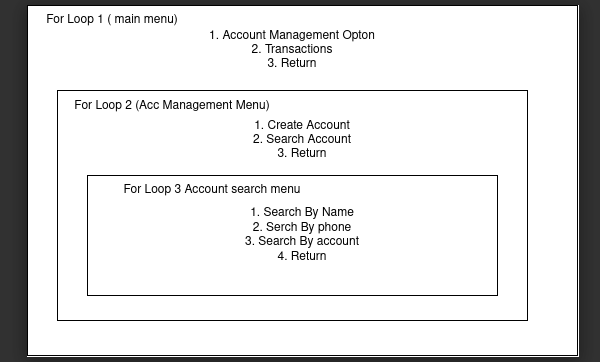

# banking-system-golang

CLI bank management in golang

# TODO

1. Input validations to be done

2. Return function bug to be resolved

# Architecture

# I Quit

**Reason** : Everytime I enter deeper into the loop getting out of it was very tricky. I first two loops were quite easy just return out of it then it was fine. But when I enter third and invoke some function in the third loop getting out from there just ate my brain.

First there was a bug that it returned but didn't rerendered the previous menu. And then I just made a workaround and made a function that would render its previous menu and then return.
But then again, it introduced another bug that I couldn't solve. I couldn't get help from any sources be it online forums, discord anywhere. First of all it was hard to explain the problem. And second I couldn't explain without showing video.
So I think its the end.

It works by the way. Just the display part is clunky. I will implement it in web form soon.
